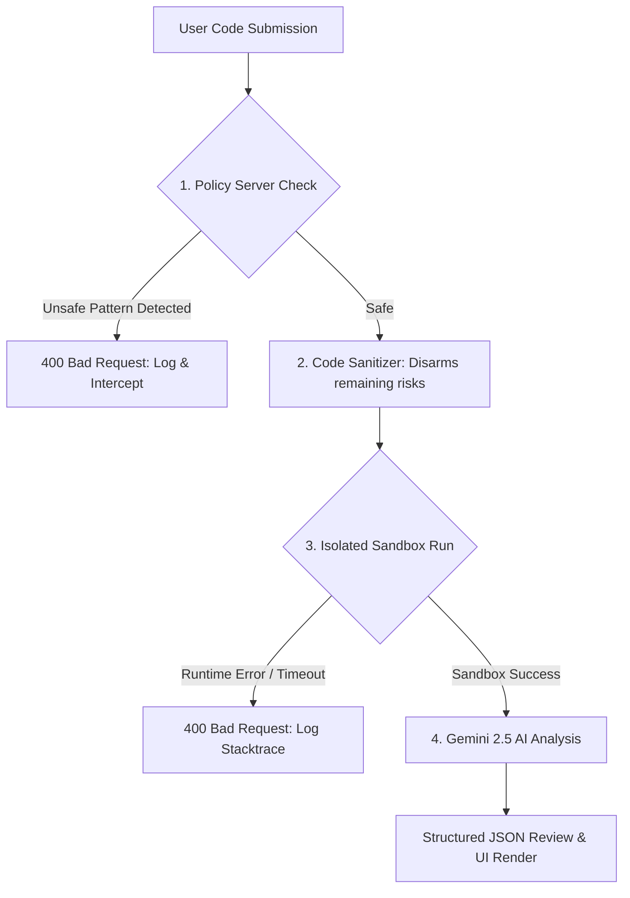

# Bug Hunter - AI-Powered Code Debugger

[](specs/security.md)
[](#📂-project-structure-key-components)
[](specs/)
[](specs/evaluation.md)
[](https://github.com/DuyQuach103/bug-hunter)

> **Unlike typical AI code assistants** that act as simple wrapper scripts, **Bug Hunter** is built with **production-grade security** and **Spec-Driven Development** at its core. It implements strict validation policies, sanitization rules, and runtime sandboxing before sending user code to the AI.

Bug Hunter is a web application that analyzes Python, Java, JavaScript, C++, Go, and Rust code using the Google Gemini API to identify syntax errors, logic flaws, performance bottlenecks, and security vulnerabilities, providing recommended fixes and complexity estimates.

---

## 🔒 Security & Sandbox – Professional-Grade Isolation

To protect the server and AI model from malicious execution, Bug Hunter implements a double-layered defense mechanism before invoking the Gemini API:



### 1. Policy Server (`policy_server.py`)
Acts as a static analysis firewall that scans user submissions for dangerous operations.
* **Blocks Forbidden Calls:** Detects and blocks `eval()`, `exec()`, `compile()`, and `__import__` calls.
* **Blocks Dangerous Modules:** Detects and blocks calls from `os.system` and the `subprocess` module.
* **Blocks Network Library Imports:** Prevents network requests by blocking the import of `socket`, `requests`, `urllib`, and `http`.
* **File Operations Guard:** Intercepts open calls attempting write, append, or exclusive creation modes (`'w'`, `'a'`, `'x'`, `'+'`).
* **Audit Logging:** Logs all requests, blocked events, and successes to `audit.log` for security audits.

### 2. Isolated Execution Sandbox (`sandbox.py`)
Compiles and runs code inside an isolated, short-lived subprocess environment.
* **Isolated Subprocess Execution:** Code is compiled/executed in a dedicated temporary folder (`.sandbox_temp/`) away from main server resources.
* **Timeout Protection:** Prevents denial-of-service (DoS) from infinite loops or hangs by capping execution at **5 seconds**.
* **Automatic Cleanup:** Guarantees all temporary binary files, compiled Java classes, and directories are deleted immediately post-run.
* **Graceful Compiler Fallbacks:** If specific compilers (`rustc`, `javac`, `g++`, `go`) are missing on the host, the sandbox safely bypasses binary execution with a warning log, ensuring the application remains portable.

---

## 📂 Project Structure (Key Components)

Bug Hunter follows a strict layout separating application code, agent configurations, test suites, and documentation.

### 1. [Agent Skills Directory](.agent/skills/)
Contains instructions and execution boundaries that model the agent's capabilities:
* [analyze-python](.agent/skills/analyze-python/SKILL.md): Scans Python code for colons, scopes, and structures.
* [analyze-java](.agent/skills/analyze-java/SKILL.md): Scans Java code for pointer safety, StringBuilder usage, and braces.
* [analyze-javascript](.agent/skills/analyze-javascript/SKILL.md): Scans JS code for type coercion, async errors, and DOM safety.
* [analyze-cpp](.agent/skills/analyze-cpp/SKILL.md): Scans C++ code for memory leaks, move semantics, and pointer safety.
* [analyze-go](.agent/skills/analyze-go/SKILL.md): Scans Go code for nil pointers, channel locks, and error checks.
* [analyze-rust](.agent/skills/analyze-rust/SKILL.md): Scans Rust code for unwrap panics, borrow checking, and unsafe code.
* [detect-language](.agent/skills/detect-language/SKILL.md): Detects programming language based on keywords and file extensions.

### 2. [Specifications Directory](specs/)
Detailed architectural designs compiled during **Spec-Driven Development**:
* [architecture.md](specs/architecture.md): System layout and client-server architecture diagram.
* [security.md](specs/security.md): 7 Pillars of Security, sandbox design, and policy descriptions.
* [evaluation.md](specs/evaluation.md): Testing plans and LLM-as-a-Judge parameters.
* [deployment.md](specs/deployment.md): Steps to deploy the containerized app via Docker and Google Cloud Run.

---

## Features

* **GitHub Dark-Style UI:** Beautiful, dark-themed user interface optimized for code reading.
* **VS Code-Style Line Numbers:** Gutter numbers line up and scroll with the code editor.
* **Drag-and-Drop Uploads:** Drag code files directly into the editor.
* **File Upload Button:** Supports `.py`, `.java`, `.js`, `.cpp`, `.go`, `.rs`, and `.txt` files.
* **Time & Space Complexity Metrics:** Instant estimated O-notation analysis on the sidebar.
* **Quality Score Removed:** Removed code quality scores to focus solely on detailed bugs, strengths, and recommendations.

---

## Setup & Installation

### 1. Navigate to Project
```bash
cd bug-hunter
```

### 2. Install Dependencies
```bash
python3 -m venv .venv
source .venv/bin/activate
pip install -r requirements.txt
```

### 3. Configure Gemini API Key
Create a `.env` file in the `bug-hunter` directory:
```env
GEMINI_API_KEY=your-api-key-here
```

---

## Running the Application

Start the Flask server:
```bash
python server.py
```

The application will start, and the web interface will be available at:
**[http://127.0.0.1:5001](http://127.0.0.1:5001)**
