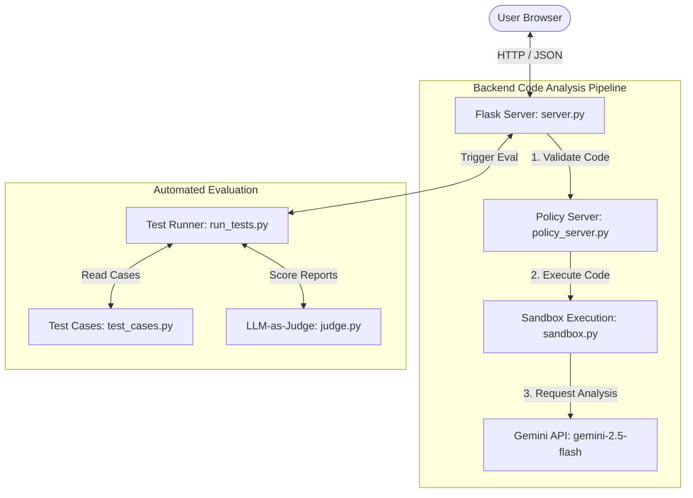

# System Architecture - Bug Hunter

This document details the system design, components, and data flow of the Bug Hunter application.

## System Overview

Bug Hunter is a multi-language source code debugger and security analyzer. It is composed of a responsive frontend client dashboard, a Flask backend processing server, a security policy validator, a secure script execution sandbox, and a GenAI analysis engine powered by Gemini.

---

## Core Components

### 1. Frontend Dashboard (`debug.html` & `index.html`)
* **Interactive Code Input**: Code editor equipped with gutter line numbers synchronized with user input. Contains a blurred suggestion placeholder displaying sample buggy scripts.
* **Analysis Report Pane**: Visualizes estimated time/space complexity, general code quality score, categorized bug lists (syntax, logic, performance, security), and general strengths.
* **Visual Diff Viewer**: Interactive side-by-side comparison pane showing original vs. corrected code.
* **Evaluation Dashboard**: UI panel showing test suite pass rates, average scores, and detailed test case results.

### 2. Flask Server (`server.py`)
* **`/debug` (GET/POST)**: Serves the dashboard page on `GET`, and orchestrates code validation, execution check, and AI analysis on `POST`.
* **`/eval` (POST)**: Triggers the test runner suite and returns evaluation metrics.
* **Structured Output Schema (`AnalysisResult`)**: Formats Gemini responses into structured JSON using Pydantic validation rules.

### 3. Policy Server (`policy_server.py`)
* **Static Analysis**: Scans input code using regex filters to detect dangerous operations (e.g. system calls, sockets, code execution statements like `exec` or `eval`).
* **Sanitization**: Comments out or strips detected unsafe lines before sending them to the execution sandbox.

### 4. Sandbox Executor (`sandbox.py`)
* **Isolated Subprocess Sandbox**: Runs the sanitized code snippet in a secure subprocess.
* **Runtime Verification**: Captures runtime crashes (e.g., divide by zero) and enforces execution time limits to detect infinite loops or hangs.

### 5. GenAI Engine (Gemini)
* **SDK Connection**: Uses `google-genai` SDK with fallback to legacy `google-generativeai` SDK.
* **Structured Prompts**: Requests structured analysis and clean corrected code, appending detailed walkthough comments strictly to the end of the file.

---

## Data Flow (POST `/debug`)

1. **User Request**: User clicks **Find Bugs** in the dashboard. The browser POSTs `{ code, lang }` to `/debug`.
2. **Policy Filter**: `PolicyServer` inspects the code. If dangerous patterns are matched, it returns `HTTP 400` with safety details.
3. **Sandbox Validation**: The code is run in `Sandbox`. If it crashes or hangs, it returns `HTTP 400` with the runtime traceback/timeout error.
4. **AI Generation**: If clean, the server constructs the prompt, passes it to the Gemini API with the Pydantic schema, and receives a structured JSON analysis.
5. **UI Rendering**: The dashboard renders complexity cards, error cards, and diff alignments.
